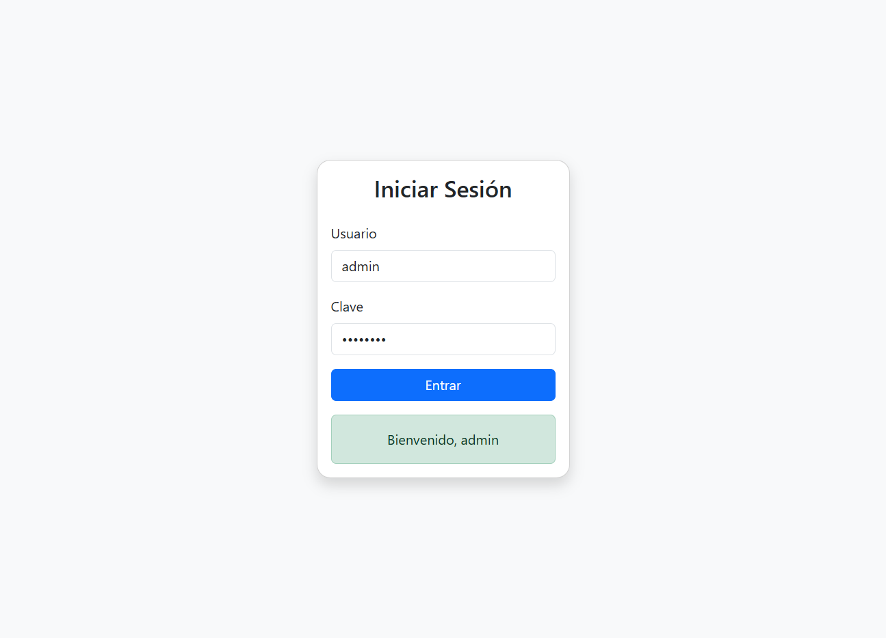

# 🧪 Inicio de Sesión Automatizado con Cucumber + Selenium

## 🎯 Objetivo  
Automatizar un escenario funcional completo utilizando **Cucumber** y **Selenium WebDriver** con **Java**, aplicando **BDD** y ejecutando pruebas desde **Visual Studio Code**, organizado con **Maven**.

---

## 📁 Estructura del Proyecto

- `src/test/resources/features/login.feature` → Archivo `.feature` con el escenario de inicio de sesión.  
- `src/test/java/steps/LoginSteps.java` → Implementación de pasos con Selenium.  
- `src/test/java/pages/LoginPage.java` → Clase Page Object con métodos y selectores.  
- `src/test/java/runner/RunCucumberTest.java` → Clase para ejecutar las pruebas.

📸 *Vista de los Screenshots:*  



---

## 🛠️ Tecnologías Usadas

- Java  
- Maven  
- Selenium WebDriver  
- Cucumber (Java + JUnit 5)  
- WebDriverManager  
- Visual Studio Code

---

## 👤 Integrante

- Carlos Vasquez

---

## 📦 Configuración

1. Crear un nuevo proyecto Maven.  
2. Configurar el `pom.xml` con las siguientes dependencias:

```xml
<!-- Cucumber -->
<dependency>
    <groupId>io.cucumber</groupId>
    <artifactId>cucumber-java</artifactId>
    <version>7.11.1</version>
</dependency>
<dependency>
    <groupId>io.cucumber</groupId>
    <artifactId>cucumber-junit-platform-engine</artifactId>
    <version>7.11.1</version>
</dependency>

<!-- Selenium y WebDriverManager -->
<dependency>
    <groupId>org.seleniumhq.selenium</groupId>
    <artifactId>selenium-java</artifactId>
    <version>4.21.0</version>
</dependency>
<dependency>
    <groupId>io.github.bonigarcia</groupId>
    <artifactId>webdrivermanager</artifactId>
    <version>5.8.0</version>
</dependency>

<!-- JUnit 5 -->
<dependency>
    <groupId>org.junit.jupiter</groupId>
    <artifactId>junit-jupiter</artifactId>
    <version>5.10.0</version>
</dependency>


